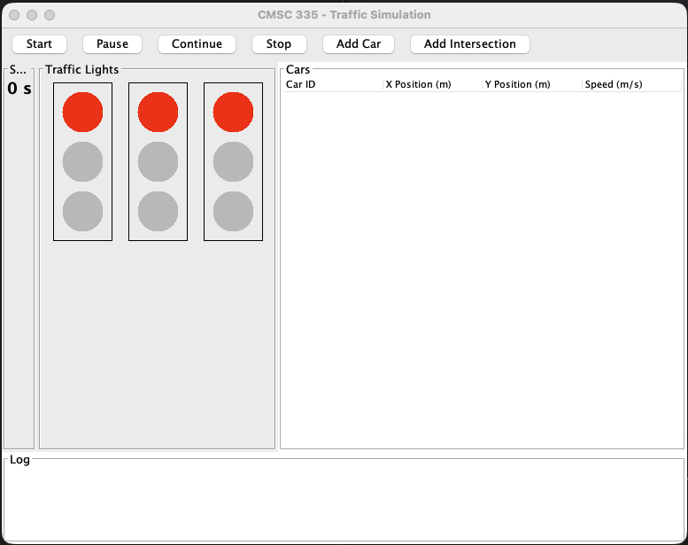
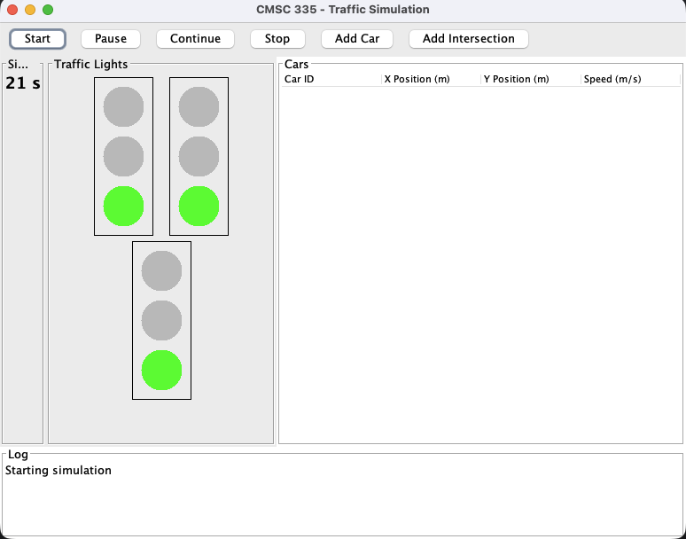
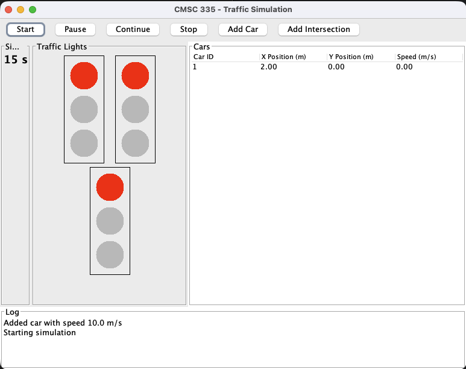

# 🌟 **🔥 PROFESSIONAL README TEMPLATE FOR YOUR PROJECT 🔥**

*(fully customized for your CMSC 335 Traffic Simulation project)*

````markdown
# 🚦 CMSC 335 Traffic Simulation  
A multi-threaded Java Swing simulation that models traffic lights, cars, timing systems, and GUI updates in real time.  
Built as the final project for CMSC 335 (Object-Oriented Programming & Data Structures).

---

## 🌐 Live Repository  
**GitHub:** https://github.com/RicardoBeckford/CMSC335-TrafficSim-Ricardo

---

## 🛠 Technologies Used  
- Java 17  
- Java Swing  
- Multi-threading (Runnable, Thread, synchronization)  
- MVC-inspired design structure  
- UML modeling  
- IntelliJ IDEA

---

## 🧩 Features  
✔ Real-time clock updated every second  
✔ Multi-threaded traffic lights with red, yellow, and green cycles  
✔ Cars that move, stop at red lights, and resume on green  
✔ GUI controls to **Start / Pause / Continue / Stop** simulation  
✔ Add unlimited cars  
✔ Add unlimited intersections dynamically  
✔ Interactive table showing car position, speed, and ID  
✔ Lightweight, clean UI using pure Java Swing  
✔ Fully object-oriented architecture

---

## 📸 Screenshots

### **Main Simulation Screen**


### **Traffic Light Cycling**


### **Car Table Updating**


### **UML Diagram**


---

## 🎮 Controls

| Action | Description |
|--------|-------------|
| **Start** | Begins all threads and updates |
| **Pause** | Freezes simulation without losing progress |
| **Continue** | Resumes all active threads |
| **Stop** | Ends the simulation completely |
| **Add Car** | Adds a vehicle with custom speed |
| **Add Intersection** | Creates a new traffic light panel |

---

## 📦 How to Run

### **1. Clone the repository**
```bash
git clone https://github.com/RicardoBeckford/CMSC335-TrafficSim-Ricardo.git
````

### **2. Open in IntelliJ**

* Open → Select folder → Let IntelliJ index project

### **3. Run Main.java**

* Navigate to `src/Main.java`
* Click **Run**

Simulation window will open.

---

## 🧠 Project Structure

```
src/
├── Car.java
├── CarThread.java
├── LightState.java
├── Main.java
├── SimulationController.java
├── SimulationGUI.java
├── TimeThread.java
├── TrafficLight.java
├── TrafficLightPanel.java
├── TrafficLightThread.java
```

---

## 📘 UML Overview

The simulation uses clean separation of concerns:

* **GUI Layer** – Displays lights, cars, table, and controls
* **Controller Layer** – Manages threads, simulation flow, and logic
* **Model Layer** – Cars, lights, timing states
* **Thread Layer** – Car movement, traffic cycling, global timer

UML is included as a PNG and in project documentation.

---

## 🧪 Testing

The project includes:

* Position updates
* Red-light stops
* Thread pausing and resuming
* Adding cars during runtime
* Adding intersections live
* Timer accuracy checks

Screenshots of test cases are included in `/screenshots`.

---

## 📝 Lessons Learned

This project helped strengthen skills in thread management, Swing UI updates, UML planning, and architectural organization. It shows how real-time systems must coordinate separate components without breaking UI responsiveness.

---

## 📄 License

This project is for academic use.
Feel free to fork or reference for learning purposes.

---

## 👨‍💻 Author

**Ricardo Beckford**
Cybersecurity & Software Development
GitHub: [https://github.com/RicardoBeckford](https://github.com/RicardoBeckford)

```

---

# 🚀 WANT IT EVEN MORE FANCY?

I can add:

✨ Color gradient headers  
✨ GitHub badges (Java version, build status, license, stars)  
✨ Clickable GIF demo  
✨ Flowchart  
✨ Shields.io badges  
✨ Table of contents  
✨ Dark/light theme screenshots  

Just tell me:

**"Make it fancier"**  
or  
**"Add badges"**  
or  
**"Add a GIF demo"**
```
